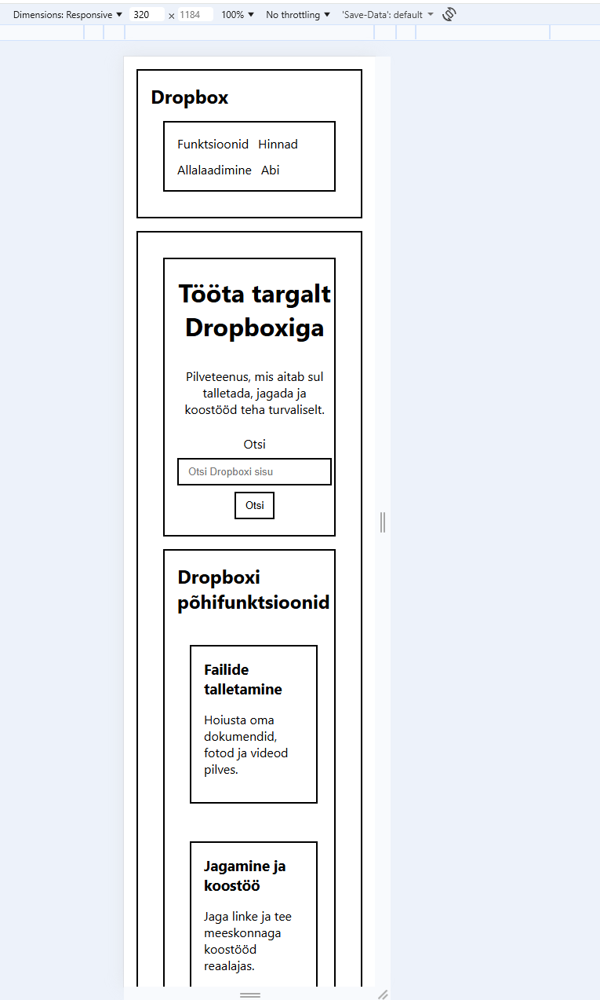

# HTML5 Traatkaart — Dropbox avaleht

**Repo:** `html5`  
**Valitud sait:** https://www.dropbox.com (ainult avaleht)  
**Eesmärk:** Harjutada HTML5 semantilist struktuuri ja ligipääsetavuse miinimumnõudeid.  
**Piirangud:** pole raamistikke ega JS-i; ei kopeeri pilte/fonte/tekste; minimaalne CSS vaid kastide eristamiseks; responsiivne.

---

## Projekti sisu
- `index.html` — semantiline skeem (valge taust, mustad kastid).
- `README.md` — lühidokumentatsioon (see fail).
- 

---

## Struktuur (plokikaart)

- **header**
  - h2: “Dropbox”
  - **nav**: Funktsioonid · Hinnad · Allalaadimine · Abi
- **main**
  - **section (hero)**: h1 + kirjeldus + `role="search"` vorm (otsing)
  - **section (promo)**: 3 × `article` (põhifunktsioonid)
  - **section (content)**:
    - `article`: Sünkroonimine (sisutekst) + `figure`/`figcaption`
    - `aside`: Lisateenused (loend)
  - **section (CTA)**: kutse tegevusele (tekst + link)
- **footer**
  - jalusnavigatsioon
  - `address`

---

## Kuidas vaadata
1. Ava `index.html` brauseris.  
2. Kitsas vaade (~320 px): kõik plokid ühes veerus.  
3. Lai vaade (≥768 px): promo 3 veerus; sisu+aside 2 veerus.

---

## Ligipääsetavus
- `<html lang="et">`
- Üks **`h1`** (hero sees); loogiline `h2`/`h3` hierarhia
- Skip-link: `Ava põhisisu (skip to content)`
- `nav`-idele `aria-label`-id; `role="search"` otsinguvormil

---

## Valideerimine
- W3C validator: 0 viga  
- Märkus: HTML5-s **tühielementidel** (`meta`, `input`) **ilma** `/>`

---

